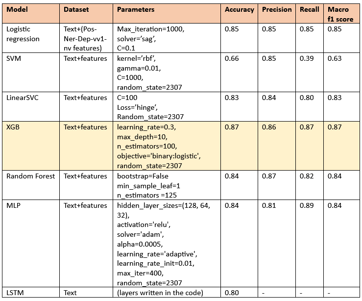

# AuTexTification

## Overview
Could you spot whether the following texts have been automatically generated?
Just consider that automatically generated text could show factual, grammatical, or coherence artifacts (Massarelli et al., 2020), along with statistical abnormalities that make the distributions of automatic and human texts differ (Ippolito et al., 2020), despite having well-shaped form (Bender et al., 2020).
Written together with M. Rizzo, P. Stabile, E. Cortese. We approached the AuTexTification task (https://sites.google.com/view/autextification) as part of the NLP MS course in Politecnico di Milano with final evaluation 30L/30

## Linguistic Features
- **Detailed Data Analysis**: Comprehensive data processing and exploration. We compute some **lexical and syntactic, features** as defined in the paper: https://aclanthology.org/W12-2019.pdf.We also define other useful features such as puntctuations percentage and ease of readability.
- **Visualization**: Multiple visual representations to convey insights effectively. Including histograms, T-statistics and density plots on features.
- **Reproducible Workflow**: Documented code with explanations for each step of our presentation in a python notebook. We include Dimensionality Reduction and Feature selection. Moreover, we describe the dataset through **vectorization** and **embedding analysis**.

## ML Models
We approached the AuTexTification task using both traditional machine learning algorithms applied to handcrafted linguistic features and Transformer-based models for text classification.

###  Machine Learning Models
Including standard machine learning algorithms, and linguistic features derived from the text. We tested several algorithms, including:

    - Logistic Regression (LR)
    - Support Vector Machine (SVM)
    - Random Forest (RF)
    - XGBoost (XGB)
    - Stochastic Gradient Descent (SGD)

The best-performing ML model was XGBoost when combining text features with dimensionality reduction techniques.

### Transformer-Based Models

Including state-of-the-art Transformer models. 

    - BERT-Base (English, Spanish)
    - DeBERTa (Decoding-Enhanced BERT with Disentangled Attention)
    - XLM-RoBERTa (Cross-lingual RoBERTa)
    - Multilingual BERT (mBERT)

## Notebook Structure
The notebook addresses two classification tasks:

    - Binary Classification – Distinguishing between human-written and machine-generated text.
    - Multiclass Classification – Identifying the specific language model that generated the text.

1. **Introduction**: Project motivation and objectives.
2. **Data Loading and Preprocessing**: Detailed steps to prepare the data.
3. **Analysis and Visualization of features**: Key insights supported by visualizations.
4. **ML and LLM models training and testing**: This research included a lot of parameters and hyperparameters tuning. We propose here only the best performing parameters we found for these specific tasks. 
5. **Results and Conclusion**: Summary of findings and future work.

## Authors
- Emanuele Cortese
- M. Olmo Nogara Notarianni
- Marco Rizzo
- Pietro Stabile

## Acknowledgments
We would like to thank our professors and peers for their valuable support and feedback throughout the project.

## License
This project is licensed under the [MIT License](LICENSE).

